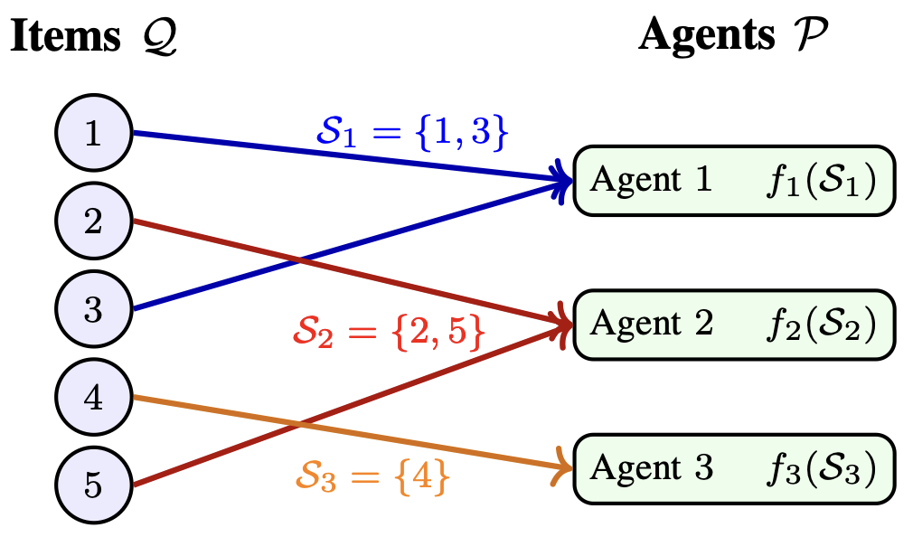
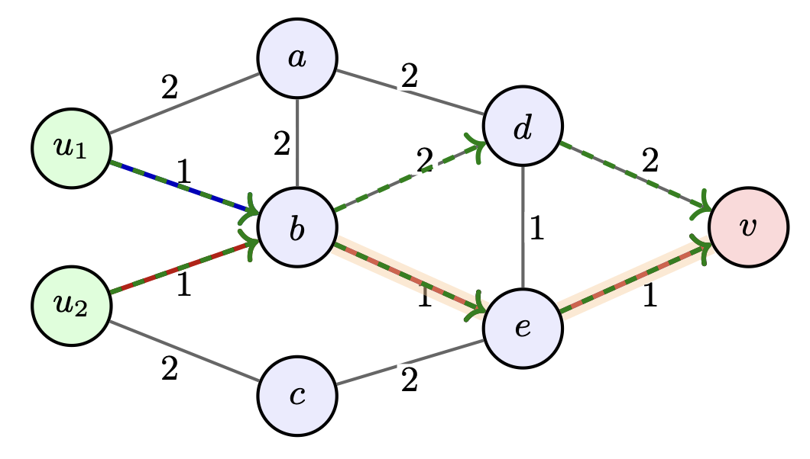
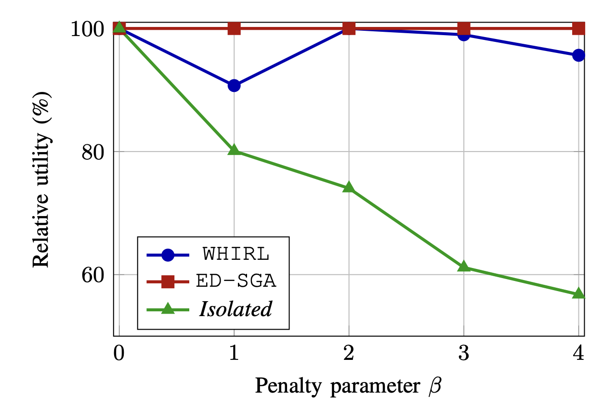
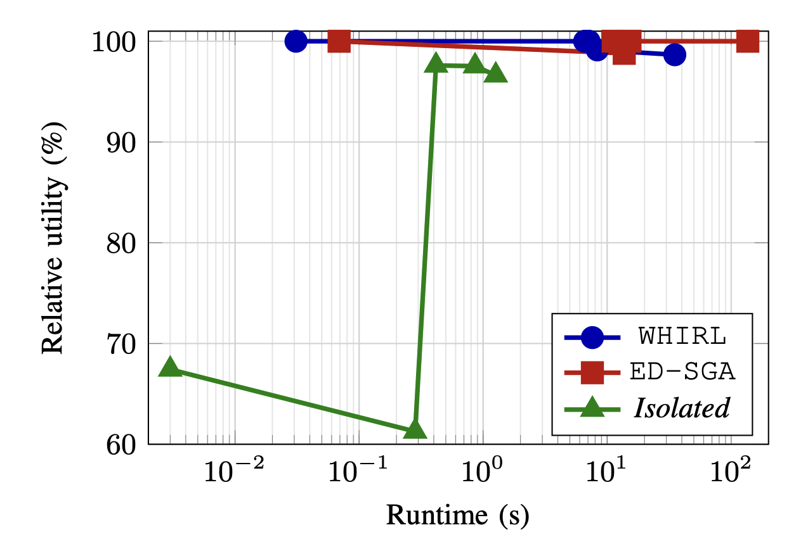

# 🌀 WHIRL  
**Welfare-based Hierarchical Routing Algorithm**

---

## 📌 Overview

This repository contains the implementation of **WHIRL**, a hierarchical algorithm for solving:

> **Submodular Welfare Maximization under Routing Coupling**

We consider the joint problem:

$\max_{S, R}  F(S) - \alpha \cdot T(S, R)$

- \(S\): allocation of items to agents  
- \(R\): routing paths in a graph  
- \(F(S)\): submodular welfare (diminishing returns)  
- \(T(S,R)\): routing cost (possibly **supermodular**, modeling congestion)

---

## 🚀 Key Insight

Even when routing introduces **nonlinear coupling (supermodularity)**:

👉 The objective remains **submodular in the allocation variable** (for fixed routing)

This allows a **hierarchical decomposition**, avoiding full combinatorial explosion.

---

## 🧠 WHIRL Algorithm

WHIRL alternates between:

1. **Routing step**
   - Solve shortest paths (or approximate routing)

2. **Allocation step**
   - Submodular maximization via greedy (SGA)

This yields:
- Fast convergence  
- Strong approximation guarantees  
- High scalability  

---

## 🖼️ Visualizations

### Welfare Allocation

---

### Routing Coupling (Modular vs Supermodular)

---

### Effect of Penalty Parameter β

---

### Utility vs Runtime Trade-off

---

## 📊 Experimental Results

We compare:

- **WHIRL (ours)**
- **ED-SGA** (expanded-domain greedy)
- **Isolated baseline** (decoupled optimization)

### Key observations

- WHIRL achieves **near-optimal performance**
- Much faster than ED-SGA at scale
- Strongly outperforms isolated baseline when coupling increases

---

## 📉 Optimality Gap

We prove the following guarantee:

$f(\bar{S}, \bar{R}) \geq \frac{1}{2} f(S^\star, R^\star) \frac{\alpha}{2} \kappa \delta |\bar{R}^\star|$

### Interpretation

- **1/2** → classical submodular approximation bound  
- **δ (modular deviation)** → measures routing nonlinearity  
- **κ** → number of agents  
- **|R̄*|** → maximum route length  

👉 When routing is close to modular (δ ≈ 0):
- WHIRL approaches **optimal behavior**

👉 As coupling increases:
- Gap degrades **gracefully with curvature**

---

## ▶️ How to Run
python example_1.py

---

## Citation

@article{vendrell2025whirl,
  title={Submodular Welfare under Routing Coupling: A Hierarchical Decomposition with Perturbation Guarantees},
  author={Vendrell Gallart, Joan and Tang-Nguyen, Nhat-Minh and Kuhnle, Alan and Kia, Solmaz},
  year={2025}
}
